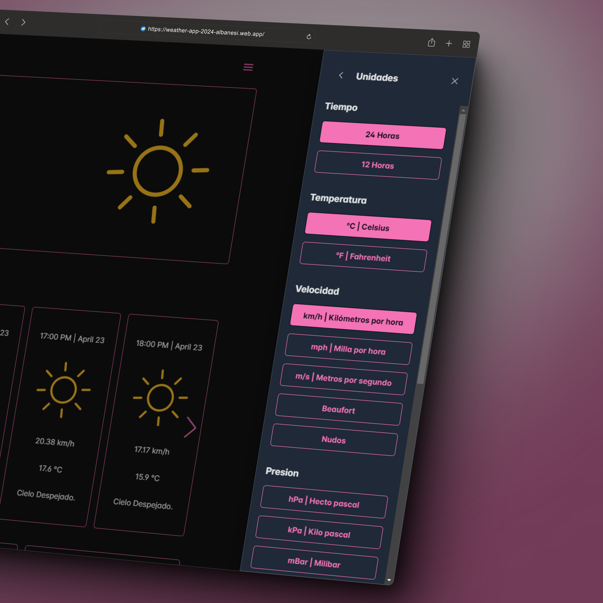

# Weather App

<br>

<p align="center">
  <a href="#Features">Features</a> •
  <a href="#Technologies-employed">Technologies employed</a> •
  <a href="#Installation-and-use">Installation and use</a> •
  <a href="#Contributions">Contributions</a>
</p>

<br>

Weather-App is a meticulously designed application aimed at providing accurate and detailed real-time weather information. It offers access to a wide range of essential weather data, from current temperature to air quality, with an intuitive interface and customizable features.

<br>


<br>
<br>

## Features

• **Weather Information**: Discover data such as current temperature, minimum and maximum, feels-like temperature, humidity, UV index, visibility, dew point, atmospheric pressure. Additionally, access hourly and daily forecasts for effective planning.

• **Search Bar**: Search any location and instantly access its detailed weather forecast.

• **Customized Push Notifications**: Stay informed with climate change alerts and set daily notifications to receive a summary of the weather in your area.

• **Flexible Measurement Units**: Adapt measurement units to your preferences with real-time options for temperature, wind speed, atmospheric pressure, visibility, and precipitation.

• **Theme Customization**: Experience a pleasant visual experience by selecting from dark or light mode and a variety of vibrant colors to tailor the app to your style.

• **Customizable Icon Pack**: Define your style with the option to switch between filled or outlined icons, and control animations according to your preferences.

• **Custom Features**: Access a full menu to enable or disable functions according to your needs and organize the app layout to your preferences.

• **Sign Up and Login**: Easily create your account or log in with your email or Google account. This will allow you to add locations to favorites and maintain your configuration preferences.

• **Multilingual**: Enjoy the app in your preferred language, with support for 11 languages, including Spanish, English, French, German, Italian, Japanese, Korean, Portuguese, Russian, Ukrainian, and Chinese.

<br>



<br>


<br>

## Technologies employed


<br>
<br>

## Installation and Use

The project is designed to work in development mode, fetching data from local mock files in JSON format located in "/assets/mocks/*.json".

If you want to test with real data, you'll need to obtain an API key from [OpenWeatherMap](https://openweathermap.org/) and a Firebase key [here](https://firebase.google.com/).

<br>

1. Clone this repository to your local machine.
   
  ```bash
  git clone https://github.com/AlbanesiDev/weather-app.git
  ```

2. Navigate to the repository directory.
   
  ```bash
  cd weather-app
  ```

3. Install the necessary dependencies.
   
  ```bash
  npm install
  ```

4. Explore the different features and characteristics.

  Run `ng serve` to start the development server.
  Go to `http://localhost:4200/` in your browser.
  The application will automatically reload for any changes in the source files.

<br>

## Contributions

Thank you for your interest in contributing to the project! Here are some guidelines on how you can collaborate and submit pull requests effectively:

### Contribution Process

1. **Fork the Repository:** Start by forking the repository to your GitHub account.
   
2. **Clone the Repository:** Clone the forked repository to your local machine using the following command:
   
   ```bash
    git clone https://github.com/AlbanesiDev/weather-app.git
   ```

3. **Create a Branch:** Create a new branch for your contribution. Use a descriptive name summarizing the nature of your work.
   
   ```bash
   $ git checkout -b your-branch-name
   ```

4. **Make your Changes:** Make necessary changes to the code, ensuring you follow the project's style conventions and best practices.

5. **Commit your Changes:** Once you've completed your changes, commit them with clear and descriptive messages.
   
   ```bash
   $ git add .
   $ git commit -m "Brief description of your changes"
   ```

6. **Update your Remote Repository:** Push your changes to your remote repository on GitHub.
   
   ```bash
   $ git push origin your-branch-name
   ```

7. **Submit a Pull Request:** Open a pull request from your branch to the main branch of the original repository. Make sure to provide a detailed description of your changes.

### Pull Request Guidelines

- **Meaningful Title:** Provide a clear and descriptive title for your pull request summarizing the purpose of your changes.
  
- **Detailed Description:** Describe in detail the changes you have made, as well as any issues resolved or any new features implemented.
  
- **Testing and Documentation:** Ensure your changes are properly tested and documented as needed.

- **References to Issues:** If your pull request is related to a specific issue, make sure to link it in the description.

- **Constructive Collaboration:** We are here to collaborate and learn together. If you have any questions or suggestions, feel free to share them in your pull request.
