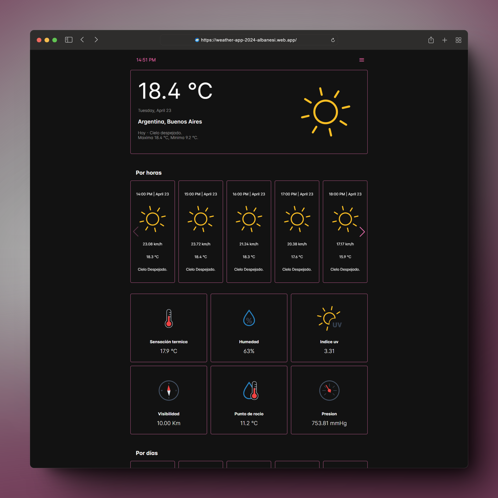
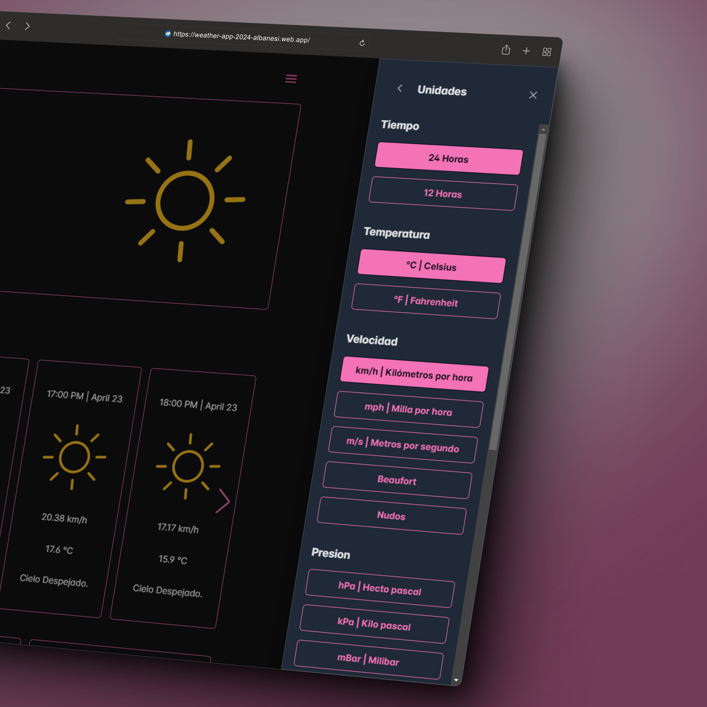
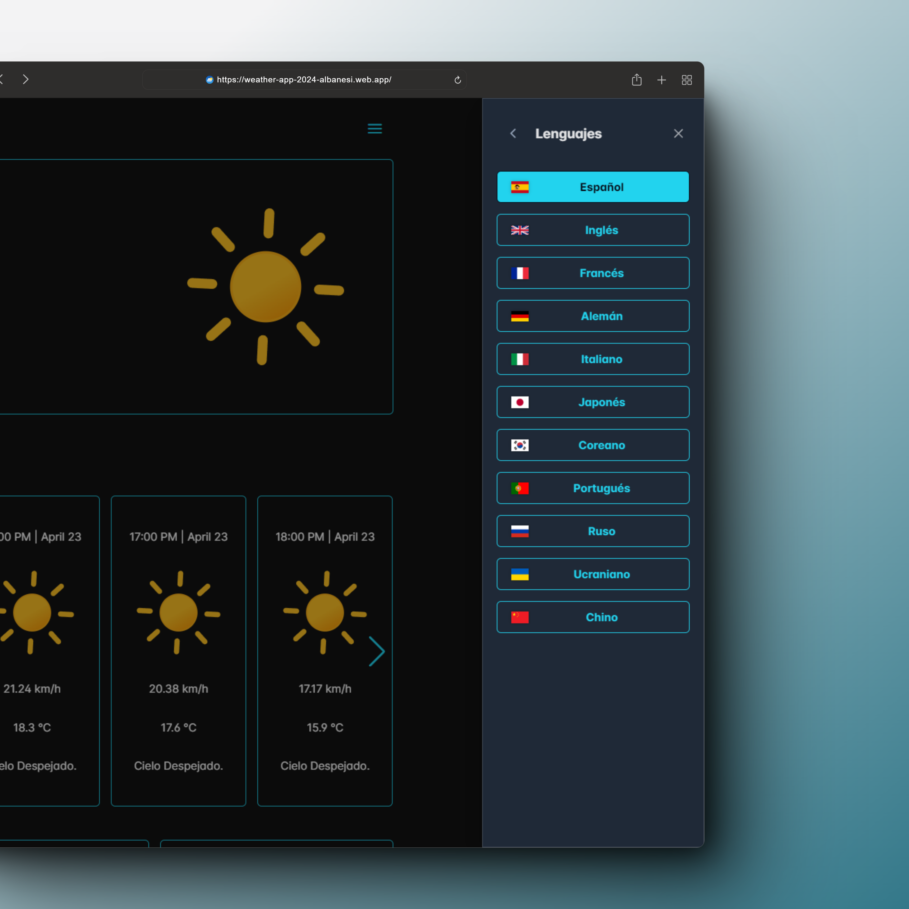

# Weather App

<br>

<p align="center">
  <a href="#Funcionalidades">Funcionalidades</a> •
  <a href="#Tecnologías-utilizadas">Tecnologías utilizadas</a> •
  <a href="#Instalación-y-uso">Instalación y uso</a> •
  <a href="#Contribuciones">Contribuciones</a>
</p>

<br>

Weather-App es una aplicación meticulosamente diseñada para brindarte información meteorológica precisa y detallada en tiempo real. Te permite acceder a una amplia gama de datos climáticos esenciales, desde la temperatura actual hasta la calidad del aire, con una interfaz intuitiva y funciones personalizables.

<br>



<br>
<br>

## Funcionalidades

• **Información del Clima**: Descubre datos como temperatura actual, mínima y máxima, sensación térmica, humedad, índice UV, visibilidad, punto de rocío, presión atmosférica. Además, accede a pronósticos por hora y por día para una planificación efectiva.

• **Barra de Búsqueda**: Busca cualquier ubicación y accede instantáneamente a su pronóstico climático detallado.

• **Notificaciones Push Personalizadas**: Mantente informado con alertas de cambio climático y configura notificaciones diarias para recibir un resumen del clima en tu área.

• **Unidades de Medida Flexibles**: Adapta las unidades de medida a tus preferencias con opciones en tiempo real para la temperatura, velocidad del viento, presión atmosférica, visibilidad y precipitación.

• **Personalización de Temas**: Experimenta una experiencia visual agradable seleccionando entre el modo oscuro o claro y una variedad de colores vibrantes para adaptar la aplicación a tu estilo.

• **Paquete de Iconos Personalizable**: Define tu estilo con la opción de cambiar entre iconos llenos o contorneados, y controla las animaciones según tus preferencias.

• **Características Personalizadas**: Accede a un menú completo para habilitar o deshabilitar funciones según tus necesidades y organizar la disposición de la aplicación según tus preferencias.

• **Registro e Inicio de Sesión**: Crea tu cuenta o inicia sesión fácilmente con tu correo electrónico o cuenta de Google. Esto te permitirá agregar ubicaciones a favoritos y mantener tus preferencias de configuración.

• **Multilingüe**: Disfruta de la aplicación en tu idioma preferido, con soporte para 11 idiomas, incluyendo español, inglés, francés, alemán, italiano, japonés, coreano, portugués, ruso, ucraniano y chino.

<br>



<br>



<br>

## Tecnologías utilizadas


<br>
<br>

## Instalación y Uso

El proyecto está diseñado para funcionar en modo de desarrollo, obteniendo datos de mocks locales en formato JSON ubicados en "/assets/mocks/*.json".

Si desea realizar pruebas con datos reales, será necesario obtener una clave de API de [OpenWeatherMap](https://openweathermap.org/) y una clave de Firebase [aquí](https://firebase.google.com/).

<br>

1. Clona este repositorio en tu máquina local.
   
  ```bash
  git clone https://github.com/AlbanesiDev/weather-app.git
  ```

2. Navega hasta el directorio del repositorio.
   
  ```bash
  cd weather-app
  ```

3. Instala las dependencias necesarias.
   
  ```bash
  npm install
  ```

4. Explora las distintas funcionalidades y características.

  Ejecuta `ng serve` para iniciar el servidor de desarrollo.
  Dirígete a `http://localhost:4200/` en tu navegador.
  La aplicación se recargará automáticamente ante cualquier cambio en los archivos de origen.

<br>

## Contribuciones

¡Agradezco tu interés en contribuir al proyecto! Aquí hay algunas pautas sobre cómo puedes colaborar y enviar pull requests de manera efectiva:

### Proceso de Contribución

1. **Fork del Repositorio:** Comienza por hacer un fork del repositorio a tu cuenta de GitHub.
   
2. **Clona el Repositorio:** Clona el repositorio forked en tu máquina local utilizando el siguiente comando:
   
   ```bash
    git clone https://github.com/AlbanesiDev/weather-app.git
   ```

3. **Crea una Rama:** Crea una nueva rama para tu contribución. Utiliza un nombre descriptivo que resuma la naturaleza de tu trabajo.
   
   ```bash
   $ git checkout -b nombre-de-tu-rama
   ```

4. **Haz tus Cambios:** Realiza los cambios necesarios en el código, asegurándote de seguir las convenciones de estilo y las prácticas recomendadas del proyecto.

5. **Haz Commit de tus Cambios:** Una vez que hayas completado tus cambios, haz commit de ellos con mensajes claros y descriptivos.
   
   ```bash
   $ git add .
   $ git commit -m "Breve descripción de tus cambios"
   ```

6. **Actualiza tu Repositorio Remoto:** Sube tus cambios a tu repositorio remoto en GitHub.
   
   ```bash
   $ git push origin nombre-de-tu-rama
   ```

7. **Envía una Pull Request:** Abre una solicitud de la pull request desde tu rama a la rama principal del repositorio original. Asegúrate de proporcionar una descripción detallada de tus cambios.

### Guía para las Pull Requests

- **Título Significativo:** Proporciona un título claro y descriptivo para tu pull request que resuma el propósito de tus cambios.
  
- **Descripción Detallada:** Describe en detalle los cambios que has realizado, así como cualquier problema que haya sido resuelto o cualquier nueva característica implementada.
  
- **Pruebas y Documentación:** Asegúrate de que tus cambios estén correctamente probados y documentados, según sea necesario.

- **Referencias a Problemas:** Si tu pull request está relacionada con un problema específico, asegúrate de vincularlo en la descripción.

- **Colaboración Constructiva:** Estamos aquí para colaborar y aprender juntos. Si tienes alguna pregunta o sugerencia, no dudes en compartirla en tu pull request.
